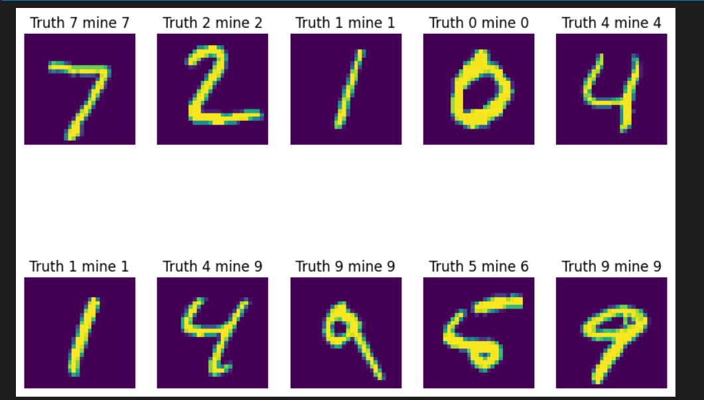

# READ THIS
This is honestly pretty useless to anyone except me. This was a project I've created to just understand deep learning better, and while there are features that work, I didn't prioritize making them accessible via a neat api or website. That being said, there are still a few runnable notebooks and a demo link

I also do use a couple outside libraries (keras, sklearn) but I try not to use them as much as I can.

# Demo links
[Autodiff and feed forward demo](http://37.27.51.34:39567/)

[CNN demo](http://37.27.51.34:41877/) 
As a side note, the CNN can be quite slow (~15 mins to train), so please be patient. I've also run the CNN code and have outputs saved in the jupyter notebook CNN/CNN.ipynb.

# Instructions for use

1. Clone the repo.
2. Run pip install -r requirements.txt
3. Inside will be a couple folders. 

Basics folder holds the model basics (ie the autodiff library and a simple feed forward neural net).
- autodiff_check.ipynb
    - I created my own autodiff library. [https://en.wikipedia.org/wiki/Automatic_differentiation] (what is automatic differentiation)
    - - I also test the custom autodiff library, performing backpropogation (checked /w jax, which is a python backpropogation library) and use gradient descent to overfit to an image
- jaxmodel.ipynb
    - due to the autodiff library having been written by a teenager with very little experience, it's not very efficient. Here, I switch over to using Jax's autodiff library, but still create all the matrices, loss functions, weight updates myself.

CNN folder has Convolutional Neural Network stuff
- CNN.ipynb
    - Uses jax to create a conolutional neural network. I implement the kernel's convolution, matrices, feed forward neural net myself, and use jax for the autodiff part.

You can also look at the code I wrote for the models, which are in the \[modelname\].py files. 

Further instructions/documentation might come up as you run the code in the notebooks.

# Screenshots:

These show the model's prediction of what a handwritten number is. (mnist dataset)

1. From overfitting to an image

2. From the feed forward neural network
 
3. From the convolutional neural network

# My notes:
Neural nets and models have always just been a black box to me, and well, it's still a black box but it's now RGB(1, 1, 1) instead of RGB(0, 0, 0)

I also did part of this project prior to shipwrecked, having written most of the base backprop from scratch library as part of another program, and then extending it with the creation of the model based on my backprop and a jax model from nearish scratch for reference and learning more about the loss and activations fxns. I was about halfway through that when shipwrecked started, and thus have logged 15 more hours finishing the jax and homemade ffnn and the homemade cnn.

# Other notes:
There isn't much actual data pipelining (ie val, shuffle, data cleaning, etc, this is more just focused on the model itself.)

